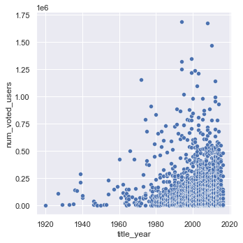
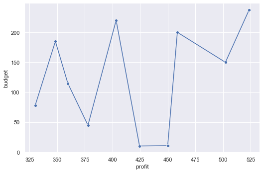
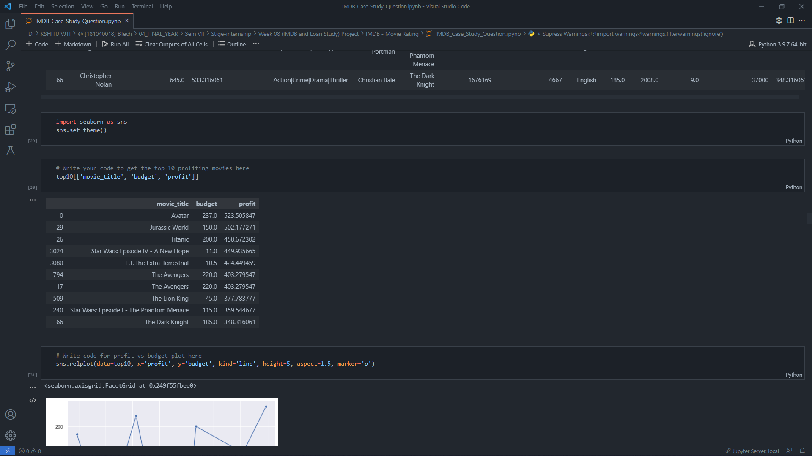

# IMDb-movie-review-Analysis
- The dataset named – “IMDB_Movies.csv” contains alot of movies reviews and data points.
- In the Jupyter Notebook Data analysis is done to show findings from the data.

> **preview of files**

   

